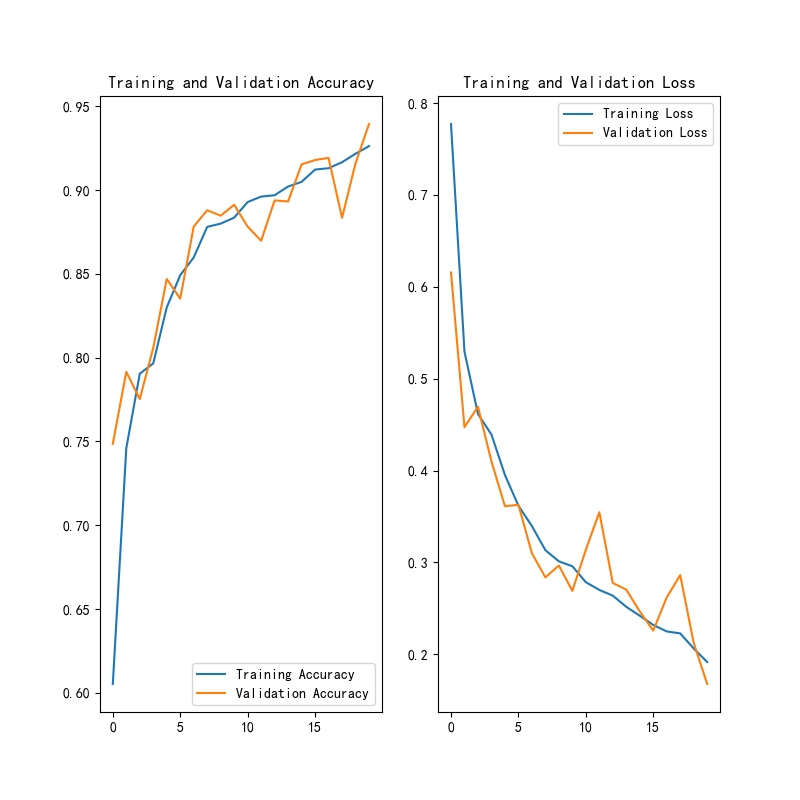

## 模型结构

```python
model = Sequential(
    name="MonaCNN",
    layers=[
        data_augmentation,
        layers.experimental.preprocessing.Rescaling(1. / 255),
        layers.Conv2D(3, 3, activation='relu'),
        layers.MaxPooling2D(),
        layers.Conv2D(64, 3, activation='relu'),
        layers.MaxPooling2D(),
        layers.Conv2D(128, 3, activation='relu'),
        layers.MaxPooling2D(),
        layers.Conv2D(256, 3, activation='relu'),
        layers.MaxPooling2D(),
        layers.Conv2D(512, 3, activation='relu'),
        layers.MaxPooling2D(),
        layers.Conv2D(1024, 3, activation='relu'),
        layers.MaxPooling2D(),
        layers.Conv2D(2048, 3, activation='relu'),
        layers.MaxPooling2D(),
        layers.Flatten(),
        layers.Dense(2048, activation='relu'),
        layers.Dropout(0.3),
        layers.Dense(1024, activation='relu'),
        layers.Dropout(0.3),
        layers.Dense(num_classes)
    ])
```

## 模型参数

```ini
[model]
version = 1.1.18
input_size = 512
batch_size = 32
k_dropout = 0.20
output_class = 2
epochs = 20
save_path = saved_model/mona
```

## 训练结果可视化



## 实际应用结果

### 单校验

```ini
;最小置信度
minimum_confidence = 0.70
```

|        图片总数        |   1826   |
| :--------------------: | :------: |
|     真实Mona类总数     |   125    |
| 模型分类出的Mona类总数 |   347    |
|  未被识别出的Mona总数  |    20    |
|  被错误识别为Mona总数  |   242    |
|     分类错误的数量     |   262    |
|   **Mona单类准确度**   | **84.0** |
|     **绝对准确率**     | **85.7** |

```ini
;最小置信度
minimum_confidence = 0.80
```

|        图片总数        |   1826   |
| :--------------------: | :------: |
|     真实mona类总数     |   125    |
| 模型分类出的mona类总数 |   280    |
|  未被识别出的mona总数  |    28    |
|  被错误识别为mona总数  |   183    |
|     分类错误的数量     |   211    |
|   **Mona单类准确度**   | **77.6** |
|     **绝对准确度**     | **88.4** |

```ini
;最小置信度
minimum_confidence = 0.90
```

|        图片总数        |   1826   |
| :--------------------: | :------: |
|     真实mona类总数     |   125    |
| 模型分类出的mona类总数 |   219    |
|  未被识别出的mona总数  |    32    |
|  被错误识别为mona总数  |   126    |
|     分类错误的数量     |   158    |
|   **Mona单类准确度**   | **74.4** |
|     **绝对准确度**     | **91.3** |

```ini
;最小置信度
minimum_confidence = 0.95
```

|        图片总数        |   1826   |
| :--------------------: | :------: |
|     真实mona类总数     |   125    |
| 模型分类出的mona类总数 |   174    |
|  未被识别出的mona总数  |    37    |
|  被错误识别为mona总数  |    86    |
|     分类错误的数量     |   123    |
|   **Mona单类准确度**   | **70.4** |
|     **绝对准确度**     | **93.3** |

## 引入迁移学习

```ini
;最小置信度
minimum_confidence = 0.95
```

|        图片总数        |   2268    |
| :--------------------: | :-------: |
|     真实mona类总数     |    156    |
| 模型分类出的mona类总数 |    188    |
|  未被识别出的mona总数  |    25     |
|  被错误识别为mona总数  |    57     |
|     分类错误的数量     |    82     |
|   **Mona单类准确度**   | **83.97** |
|     **绝对准确度**     | **96.2**  |


